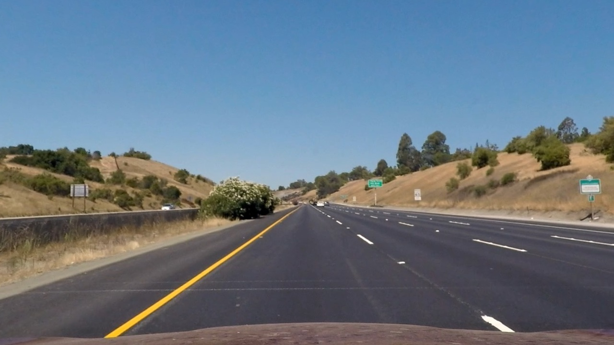
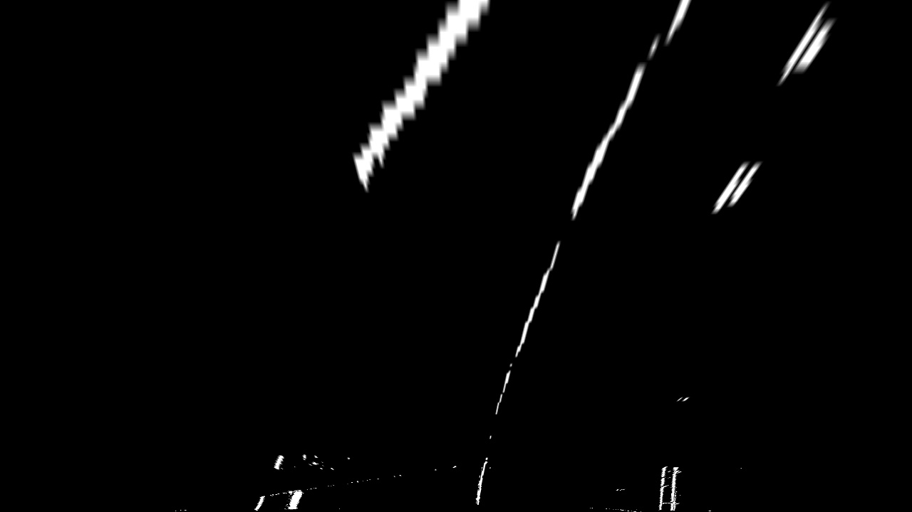

# Advanced Lane Finding Project

The goals / steps of this project are the following:

1. Compute the camera calibration matrix and distortion coefficients given a set of chessboard images.
2. Apply a distortion correction to raw images.
3. Process image to create a thresholded binary image.
4. Apply a perspective transform to rectify binary image ("birds-eye view").
5. Detect lane pixels and fit to find the lane boundary.
6. Determine the curvature of the lane and vehicle position with respect to center.
7. Warp the detected lane boundaries back onto the original image and output visual display of the lane boundaries and numerical estimation of lane curvature and vehicle position.
8. Video Processing Pipeline

[//]: # (Image References)

[image1]: ./examples/undistort_output.png "Undistorted"
[image2]: ./test_images/test1.jpg "Road Transformed"
[image3]: ./examples/binary_combo_example.jpg "Binary Example"
[image4]: ./examples/warped_straight_lines.jpg "Warp Example"
[image5]: ./examples/color_fit_lines.jpg "Fit Visual"
[image6]: ./examples/example_output.jpg "Output"
[video1]: ./project_video.mp4 "Video"

## 1. Compute the camera calibration matrix and distortion coefficients given a set of chessboard images.

At first we are going to correct images that are distorted by camera. To to this we use samples of chessboard patterns recorded with the same camera that was also used for images and video recordings provided.

At the begining we preparr "object points" with (x, y) coordinates of the chessboard corners in the world. Objpoints are appended with a copy of it every time program successfully detect all chessboard corners. Imgpoints are appended with the  position of each of the corners in the image plane on successful chessboard detection.

We use objpoints and imgpoints to compute the camera calibration and distortion coefficients by cv2.calibrateCamera() function. To undistort we apply distortion correction by the cv2.undistort() function. 

## 2. Apply a distortion correction to raw images.

##3. Process image to create a thresholded binary image.

For the best results in color thresholding we use HLS space. We apply sobel filters to detect edges. We choose only the L and S channel, because its most informative for lane finding and best performance in different color and lighting conditions. We use S-channel for a gradient filter along X and Saturation threshold We use L-channel for a luminosity threshold filter. Then we merge the results of these filters to binarize an image.

Examples of output binarized

# 4. Apply a perspective transform to rectify binary image ("birds-eye view").
For perspective transform to "bird's eye" perspective we use function called warp() and we use unwarp() fucntion for reverse transformation. In function we use the parameters src and  dst to  transform images.

For correct transformation we provide four source and destination points. I have selected the following source and destination points.

| Source        | Destination   | 
|:-------------:|:-------------:| 
| 190, 720      | 340, 720      | 
| 588, 456      | 340, 0        |
| 698, 456      | 995, 0        |
| 1145, 720     | 995, 720      |

I verified the performance of my perspective transformation by transforming an image with straight lines (./test_images/straight_lines1.jpg) using above source and destination points. The result is below.

I also included a region of interest to reduce artefacts at the bottom of the image - the function region_of_interest(). See the samples below.

Sample test image test4

# 5. Detect lane pixels and fit to find the lane boundary.
I use the function find_peaks(img,thresh) to compute a histogram of detected pixel values. It takes the bottom half of a binarized and warped lane image. The function find_peaks returns the x values of the peaks that are larger than thresh.

The function get_next_slice(img,center_point,width) takes binary image and computes the average x value center of all detected pixels in a window centered at center_point of width. Then function returns a masked copy of img and a center.

The following function lane_from_window(binary,center_point,width) slices a binary image horizontally into 6 zones and applies get_next_window to each of slice. The center_point of each zone is the center value of the previous slice. Thus subsequent windows follow the lane if the road changes its curvature. The  lane_from_window returns a masked image of a single lane line. 

The Line.update(img) method takes a binary input image of a lane line candidate and fits a second order polynomial to the provided data. It also computes  metrics. Then I check chosen lanes and push them into que. Every time we find a new line, we update metrics. If we detect no lines, we use last result until the queue is empty and peaks need to be searched anew.

Then we save a fit to the lane candidate to current_fit_xvals attribute and its coefficients. Thus we get result of two lines.

# 6. Determine the curvature of the lane and vehicle position with respect to center.
I compute the radius of curvature in method set_radius_of_curvature(). 
For a second order polynomial f(y)=A y^2 +B y + C the radius of curvature is given by R = [(1+(2 Ay +B)^2 )^3/2]/|2A|.

I compute the distance from the center of the lane in the set_line_base_pos() method. It measures the distance to each lane and computes the position.

# 7. Warp the detected lane boundaries back onto the original image and output visual display of the lane boundaries and numerical estimation of lane curvature and vehicle position.

# 8. Video Processing Pipeline
We use for pipeline the same fucnctions as we use for image transformation. For convenience we collected all of them in one cell. 

Final video output (github) Here's a [link to my video result](./processed_project_video.mp4)

Final video output (youtube) ([https://youtu.be/9qA_sxot63E](https://youtu.be/9qA_sxot63E "Output results"))

# Conclusions and Future Directions

The pipeline works not very well different road conditions especially with shadowed frames.
Example of troublesome image

I would like to improve my computer vision pipeline to detect lanes more exactly. I am going to tune up the parameters and use other color detection schemes.
To do this I'd like to implement diagnosis panel created by Arnaldo Gunzi (reference https://chatbotslife.com/advanced-lane-line-project-7635ddca1960#.o0bdspyn4)
